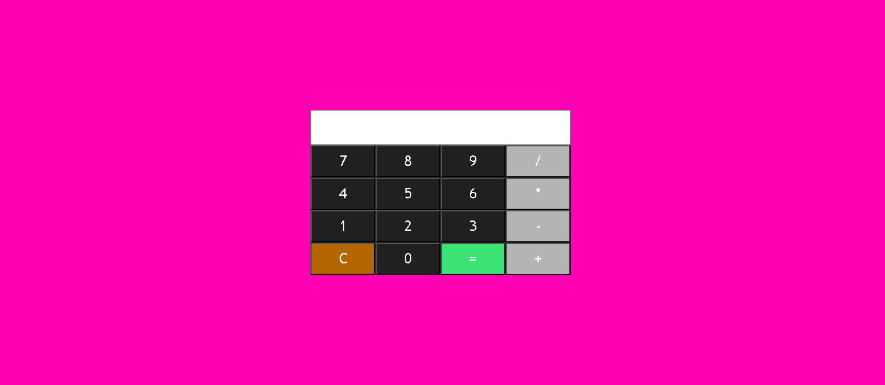

# Calculadora JS
Uma calculadora com javascript!

# 📋 Descrição
O projeto foi desenvolvido inicialmente como um trabalho da faculdade porem posteriormente decidi o aprimorar para ultilizar como projeto de portifolio

# ⚙️ Funcionamento

A calculadora realiza as quatro operações matematicas basicas de adição, subtração, multiplicação e divisão. Ela possuiu em seu codigo três funções em javascript que realizam toda a logica da aplicação, seriam essas a função botao() que obtem as valores do codigo html, calcula() que ultilza a função eval() nativa do javascript para efetuar as operações e a função onlynumber() que é responsavel por permitir que apenas numeros e caracteres especiais sejam renderizados na tela. Caso alguma operação mais complexa seja inserida ultilizando caracteres especiais o resultado será mostrado na tela mesmo que a operção não conste entre as 4 operções basicas do teclado.

